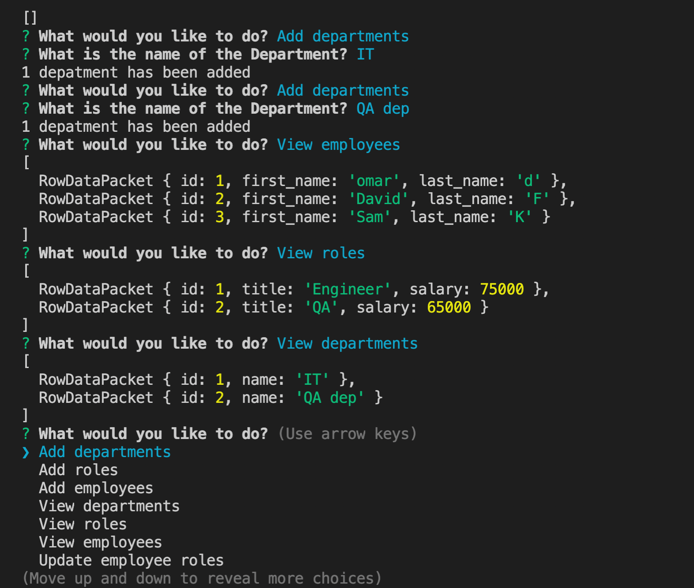

# employeeTracker

License for this app is : MIT

# Table of Contents

- [Description](#description)
- [Installation](#installation)
- [Demo](#demo)
- [License](#license)
- [Questions](#questions)

## Description:
    This command-line application is to track employees and their roles within the company, as it will allow you to add departments, employees and roles and view a list of each one.

## Installation:
    mysql, and inquirer

## Demo:

## License:
    For information about the license, click the link below.

- [License](https://opensource.org/license/random)

## Questions:
    Contact me at the following Link:

-[GitHub Profile](https://github.com/omartdh)

    Send me an email at: omartdh@gmail.com